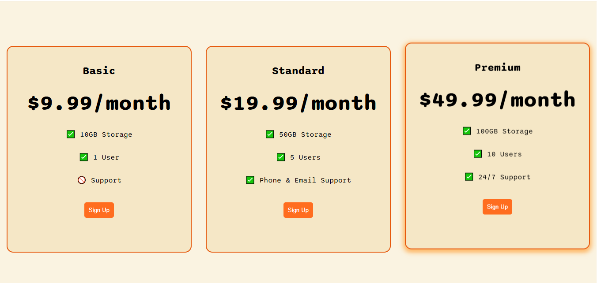

# Flexbox Pricing Table

## 🚀 Live Demo
[Click here to view the live demo](https://karuppaiya-dev.github.io/Flexbox-Pricing-Table/)

A simple and responsive pricing table built using HTML and CSS Flexbox.

## 🚀 Features
- Fully responsive design
- Smooth hover animation
- Modern UI with custom CSS variables
- Clean and easy-to-read layout

## 🛠️ Technologies Used
- HTML5
- CSS3 (Flexbox, Media Queries, CSS Variables)
- Google Fonts

## 📱 Responsive Design
- Horizontal layout on large screens
- Stacks cards vertically on small screens

## 💡 What I Learned
- Flexbox layout system
- Hover animations & box-shadow effects
- Using `:root` for CSS variable colors
- Media queries for mobile responsiveness

### 📷 Preview

